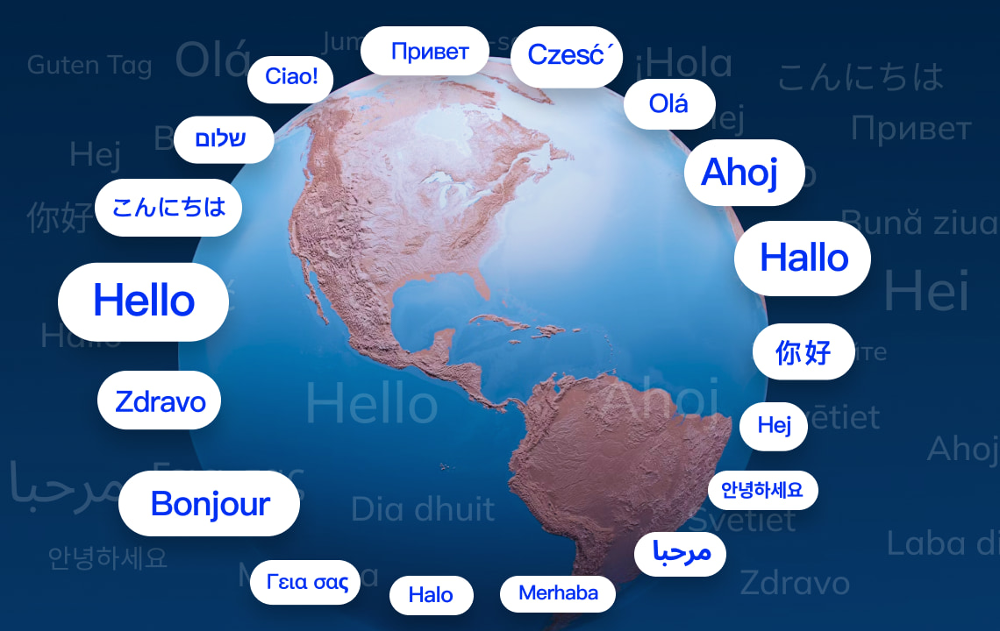

# What AI Video Translators Are

AI video translators use artificial intelligence to translate video content, including audio and subtitles, into other languages automatically.  
Modern tools not only translate text but can also dub audio, generate subtitles, perform voice cloning, and even sync mouth movements in the video to the translated speech (lip-sync).

## Top AI Video Translator Tools in 2025

### VMEG AI – Best All-in-One AI Video Translator for Creators & Businesses

[VMEG AI](https://vmeg.ai/?utm_source=victor-git) is a comprehensive AI-powered video localization platform that offers automatic dubbing, multi-language subtitle translation, voice cloning across global languages, and post-processed lip-sync — all within a user-friendly browser interface.  
It's the only localization solution that supports voice cloning for virtually every major language, making it a standout tool for creators, educators, and businesses aiming to scale their global content without compromising quality.

### HeyGen

HeyGen offers a mix of AI avatars and realistic video dubbing with strong lip-sync performance. It supports uploading your own video, translating the speech, and reanimating the speaker’s lips to match the dubbed voice.

### Rask

Rask is a fast-growing video localization platform that specializes in multilingual dubbing, transcription, and subtitle generation.

### Synthesia

Synthesia is best known as a pioneer in AI avatar-based video creation, allowing users to generate professional-looking videos simply by typing a script and choosing from over 100 avatars.

### VEED

VEED is a well-known online video editor that recently introduced AI-powered subtitle and voiceover translation as part of its expanding toolkit.

### Kapwing

Kapwing is another lightweight online editor that supports subtitle translation and dubbed voiceovers using AI-generated voices.

### Maestra

Maestra is an AI-powered dubbing and subtitle generation platform designed for educators, content creators, and global marketing teams. It offers fast and accurate auto-subtitling, voiceover translation in 60+ languages, and easy team collaboration tools.

